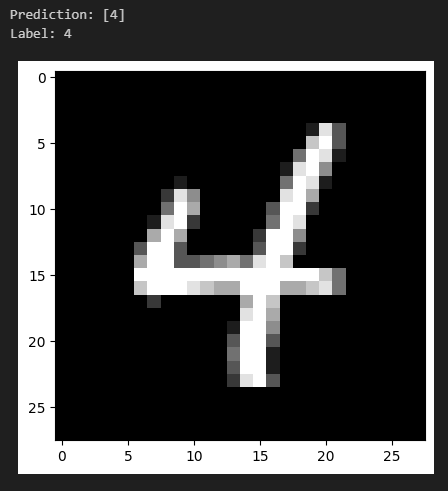
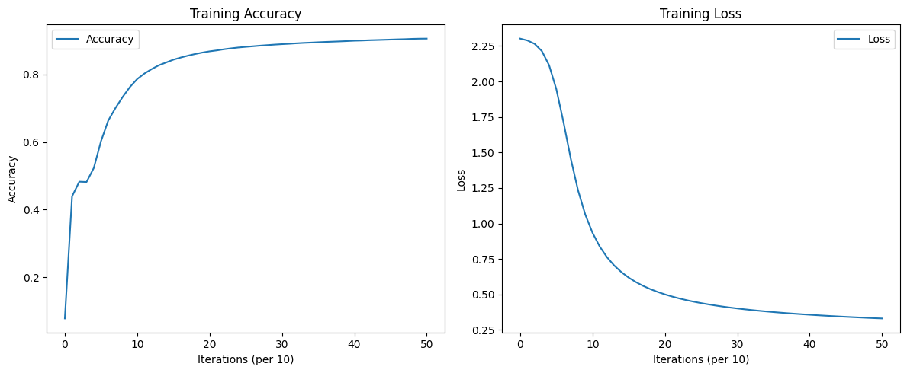

# Neural Network Training and Visualization without TensorFlow or Pytorch!

## Overview

This repository contains a Jupyter Notebook (accessable via Google Colab or Download) for training a neural network and visualizing its performance metrics. The project provides a toolkit for conducting gradient descent optimization, tracking training progress, and plotting the evolution of weights and biases over time. No Keras, no PyTorch, no TensorFlow - just NumPy!

There are plenty of improvements that could be made to the model, but this was an exercise in understanding how deep learning models can be built using pure mathematics - having said that it impressively achieves ~90% prediction accuracy:



## Features

- **Neural Network Training**: Implements gradient descent to optimize weights and biases.
- **Performance Tracking**: Logs accuracy and loss at regular intervals.
- **Visualization Tools**: Plots training metrics, weights, and biases over iterations.
- **Prediction and Testing**: Generates predictions and visualizes results for individual samples.

Example outputs are presented here:



## Requirements

- Google Colab
- NumPy
- Matplotlib

## Usage

1. **Open the Notebook in Colab**:
    - [Open in Colab](https://colab.research.google.com/drive/1Biiwy6HHk1jdfxcWuIEVM3tfTHmqJCur?usp=sharing)
    - You'll be prompted to upload your Kaggle API token to your Colab environment to download the MINST dataset for this demo.
    - This token can be downloaded from your Kaggle account settings (Account tab, under the API section, you can create a new API token).

2. **Train the Neural Network**:
    - Follow the steps in the notebook to train the model using your data.

3. **Plot Training Metrics**:
    - Use the provided code cells to plot accuracy and loss.

4. **Plot Weights and Biases**:
    - Visualize the evolution of weights and biases over the training iterations.

5. **Evaluate and Test Predictions**:
    - Generate predictions and visualize them using the provided code cells.
  
Alternatively you can run the code locally:

```bash
git clone https://github.com/benjamin-hutchings/Neural-Net-Using-NumPy.git
cd Neural-Net-Using-NumPy
```

## License

This project is licensed under the MIT License.